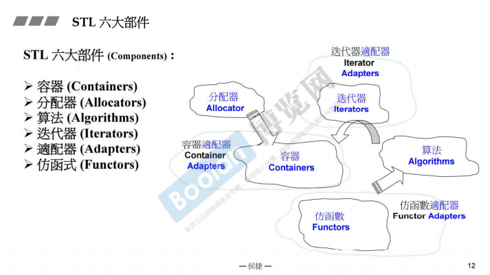
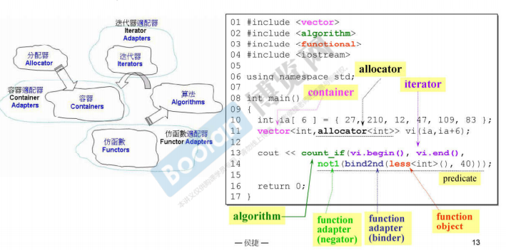
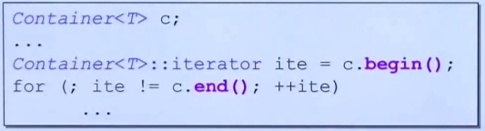
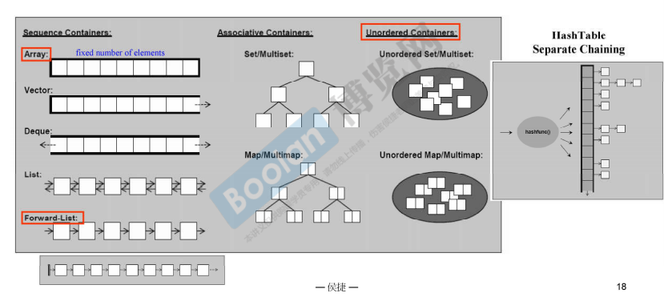
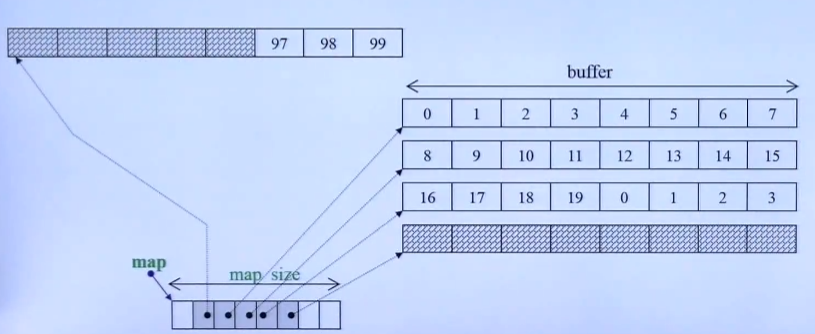
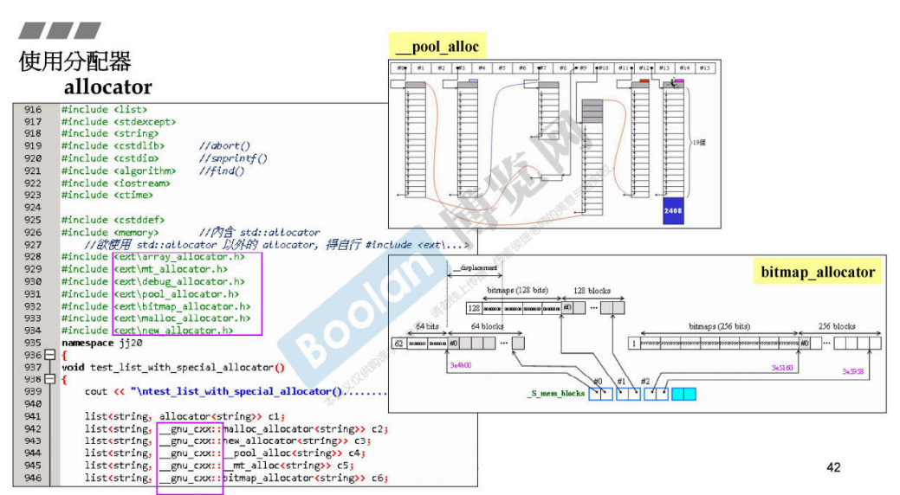

# P1 认识headers、版本、重要资源

- generic programming泛型编程，就是用template为主要工具来编写程序
- 标准库以头文件的形式呈现：
  - c++标准库的头文件不带.h，eg $include \<vector>
  - 新式c的头文件也不带.h，eg #include \<cstdio>
  - 旧式的c头文件可以带.h，eg #include \<stdio.h>
  - 新式的headers里的组件封装在namespace std里
  - 旧式的headers内的组件不封装在namespace std里
- 介绍网站    www.cplusplus.com；gcc.gnu.org

# P2 STL体系结构基础介绍

- 
- 分配器allocator来支持容器containers来分配内存空间
- Adapters适配器用来做转换
- 六大部件的关系
- 
- 一般来说这个容器的allocator不用写，编译器管了
- count_if是一个模板函数，查找一定范围内满足条件的元素个数
- 容器调用.begin()和.end()，得到两个iterators
- bind2nd，绑定第二参数
- not1，表示negator，取反，原本是<40，现在成了≥40，并且返回一个bool，用来给count_if做if判断，最后count_if返回一个int
- 复杂度 complexity
  1. O(1)，常数时间，constant time
  2. O(n)，线性时间 Linear time
  3. O(log~2~n)，次线性时间 sub-linear time
  4. O(n^2^), 平方时间 quadratic time
  5. O(n^3^), 立方时间 cubic time
  6. O(2^n^)，指数时间 exponential time
  7. O(nlog~2~n)，介于线性和平方的中间行为
- begin()和end()，前闭后开区间，begin能拿到元素，end拿不到元素，指向最后一个元素的下一个位置
- 
- iterator要遵循上面的写法，从某个具体的容器中，调用其对应的iterator，再基于这个iterator来进行遍历
- iterator就是一个高级的指针，所以指针能做的操作，iterator都可以做，*，->，++，--都可以
- range-based for statement，取代了过去的for循环，python类似的for，用了auto之后更像py了
- 有了auto之后，iterator的类型也不用写了，写个auto，编译器给你推导

# P3 容器分类与测试（一）

- 
- 大致分为三种：
  1. 顺序容器 sequence containers
     1. array：元素个数固定
     2. vector：可以自动增长
     3. deque：前后都可以扩充
     4. list：双向链表
     5. forward-list：单向链表
  2. 关系容器 associative containers
     1. set/multiset
     2. map/multimap
  3. 不定序容器 unordered containers
     1. unordered set/multiset
     2. unordered map/multimap

- hashtable的组织形式有多种，目前最广泛应用的是separate chaining这种，就是vector+forwardlist

# P4 P5 容器分类与检测（二）（三）

- 使用容器array
- 使用容器vector
  - 写测试程序的时候，可以把不同测试单元写在不同namespace里，对应需求的头文件可以放在namespace上面，重复的头文件有保护机制，不会被重复包含进来
  - try catch机制加上abort()，可以完美cover异常情况

- 使用容器list
  - list这里有个max_size的参数，3亿5千万。按理说list按内存分配，不应该有这个参数，要等下一章讲。
  - 标准库本来有一个::sort()，某些容器自己里面也有个.sort()，针对容器特性定的。
- 使用容器forward_list
  - .push_front()，应该是头插法
- 使用容器slist
  - 非标准库，是gnu编译器历史遗留问题，Include在<ext\\slist>里
- 使用容器deque
  - deque也可以扩充，并且两边都可以扩充，它的结构是这样：
  - 每个buffer可以放一些元素，deque是由一段段连续的，叫做分段连续，在buffer的基础上，包装出一个连续性出来
  - 

-  容器stack和queue
  - 底层就是包了一个deque
  - 有人不把这两个叫做容器，而是把它们叫做deque的adapters，容器包了一层嘛

# P6 容器分类与检测（四）

- 前面介绍的是顺序容器，接下来介绍关联容器
  - 容器multiset
    - 底层是红黑树
  - 容器是multimap
  - unordered_multiset
  - unordered_multimap
- 前面四种都有multi，也就是允许重复的key
- 后面的四个没有multi，也就是key都是独一无二的
  - set
  - map
  - 剩下两个是底部由hash支撑的两个unordered无序容器
  - unordered_set
  - unordered_map

# P7 对分配器的测试

- 容器都有自己默认的分配器allocator
- 
- 如果要更换容器的allocator，要在\__gnu\_cxx::这个命名空间下调用对应的allocator，每种的设计都不相同，这里给出两种的架构实现：
  - \__pool_alloc 内存池
  - bitmap_allocator 位图
- 分配器直接用不太建议，大量的就直接用容器，小量的就用传统的new