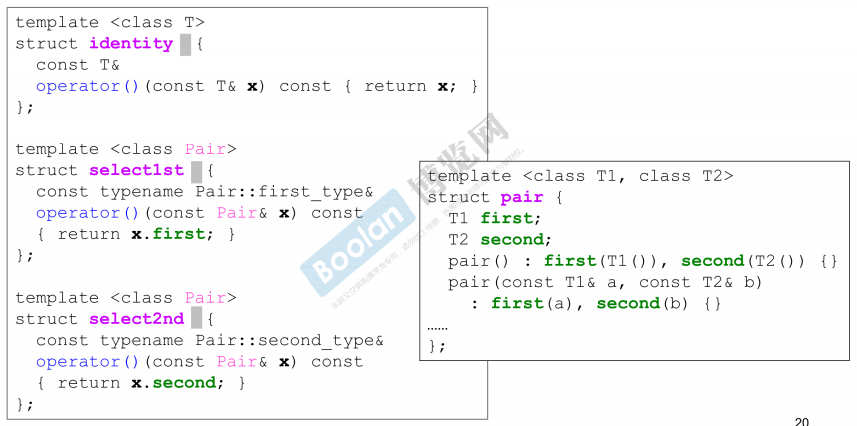
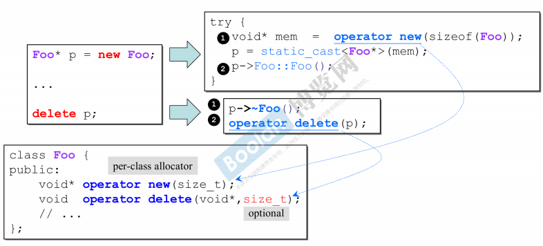

# P1 导读

- 泛型编程和面向对象编程都会讲

# P2 conversion function 转换函数

- 
- 转换函数，也就是重载了类型转换运算符，通常加const，无参数，无返回值，而且也没必要显式调用，隐式类型转换的时候，就会被自动调用转换函数
- 这个目标转换类型可以是基本类型，也可以是前面出现过的自定义类型

# P3 non-explicit-one-argument constructor

- 
- 这里就是反向转换了，把4转换成Fraction类型
- 
- 在两个并存，并且加的顺序改了之后，会产生ambiguous二义性，报错无法通过
- explicit-one-argument ctor 明确的单参数构造函数
- 
- 加上这个，4就不能随便转成4/1了。
- explicit关键字基本都用在构造函数前

# P4 pointer-like classes

### 智能指针

- 一个类设计出来像指针，但是比指针更多一些功能
- 
- 这里对指针的两个运算符重载，是语法规定一定要这样写

### 迭代器

- 迭代器也是一种智能指针，迭代器在指针上包了一层，主要用来遍历容器

# P5 function-like classes

- 设计一个class，让他的行为像一个函数
- 通常重载小括号运算符，通常都继承一些父类，这些父类大小为0，没有函数，只有一些类型的typedef，比如unary_function，binary_function等等
- 

# P6 namespace经验谈

# P7 class template 类模板

# P8 function template 函数模板

- 

# P9 member template 成员模板

- 
- 黄色这一段在模板类里面，本身又是模板，所以叫成员模板
- T1 T2确定后，U1 U2还能变
- 这里的要求是初值p的U1能转型成T1，U2能转型成T2
- 向上转型up-cast
- 智能指针中也利用了这个成员模板
- 

# P10 specialization 模板特化

- 从模板中抽出一些特殊的情况，给它开小灶，单独实现，调的时候优先调它

# P11 partial specialization 模板偏特化

1. 个数的偏，绑定了一部分T

2. 范围的偏，不如从一个任意类型的T，到一个指针类型的T，也是一种偏特化

# P12 template template parameter 模板模板参数

- 搞蛇皮啊，禁止套娃...
- 这一段模模糊糊...

# P13 关于c++标准库

- 
- 多写点小程序来测一下标准库的容器和算法
- 关于检查编译器支持c++哪个标准
  - 通过查看__cplusplus这个内置宏的值，199711就是c++98，201103就是c++11
  - 可以在编译的时候，末尾加上-std=c++11或者-std=c++14，就可以支持到对应版本

# P14 三个主题

### variadic templates(since c++11) 不定模板参数

- 允许写任意个数的模板参数

### auto(since c++11) 自动类型推导

- 要用auto之前，一定得先赋值。没赋值之前没法推导

### ranged-base for (since c++11)

- 
- 这就有点像python了

# P15 reference 引用

- ```c++
  int x = 0;
  int& r = x;
  int x2 = 5;
  r = x2;
  ```

- 引用在赋初值之后就是别名了，等算一个const的pointer，再给它赋值，就等于给原本的x赋值了。但是编译器会把r和x变得一摸一样，不管是地址还是大小，二者都相同。

- reference通常不用于声明变量，而是用于传参和传返回值

- 

# P16 Object Model 对象模型

### Inheritance关系下的构造和析构

### Composition关系下的构造和析构

### Inheritance+Composition关系下的构造和析构

- 
- 这里谁先谁后不好说，看具体编译器的实现

# P17 对象模型 关于vptr和vtbl 虚指针和虚表

- 只要你的类里有虚函数，你的对象里就会多一个虚指针，指向一个虚表
- 继承，不止继承数据，也继承函数。而函数的占用内存大小不确定，所以继承函数，继承的不是函数的内存大小，而是函数的调用权
- 
- 通过对象来调用虚函数时，不做静态绑定，而是动态绑定
  - 静态绑定就是函数被编译成call xxx，xxx是一个地址，是固定的
  - 动态绑定就是这个地址存在虚表里，还得找一趟
- 这里这个或，就没怎么懂，有哪个不行吗？感觉两个都对

# P18 对象模型 关于this

- 
- 重点是这个this，左上角那两句就是动态绑定

# P19 关于Dynamic Binding 动态绑定

- 这里通过对象来调用函数，属于静态绑定
- 
- 下面通过指针来调用函数，属于动态绑定
- 
  - 这里的汇编，dword ptr就是一个2字节的指针，mov a b就是把b的值赋给a
  - mov eax,dword ptr[pa]；
  - 就是把指针pa所指地址的值取出来赋给eax

# P20 谈谈const

- const放在函数参数后面，是const member functions常量成员函数，一般的全局函数不能这样放
- 
- const object不能调用non-const member functions
- const也属于函数签名的一部分
- 标准库的string使用了引用计数法，可以共享字符串的内容

# P21 关于new delete

- new：先分配memory，再调用ctor
- delete：先调用dtor，再调用memory

# P22 重载::operator new ::operator delete ::operator new[] ::operator delete[]

- 
- 可以通过重载这些，接管内存的malloc和free
- 重载带[]的new和delete，就是对象数组，内存空间大小就是对象数量*对象大小+一个表示对象数量的int值

# P23 示例

- 
- 通过加::，可以绕过现有的成员函数，直接调用全局的new和delete

# P24 重载new()，delete()

- 可以重载class member operator new()，前提是每个版本的重载都必须有独特的参数列，并且第一参数必须是size_t，其余参数以new所指定的placement arguments为初值

# P25 basic_string 使用new(extra)扩充申请量

- 为了在字符串里添加引用计数的功能，使用了new(extra)来实现
- 

